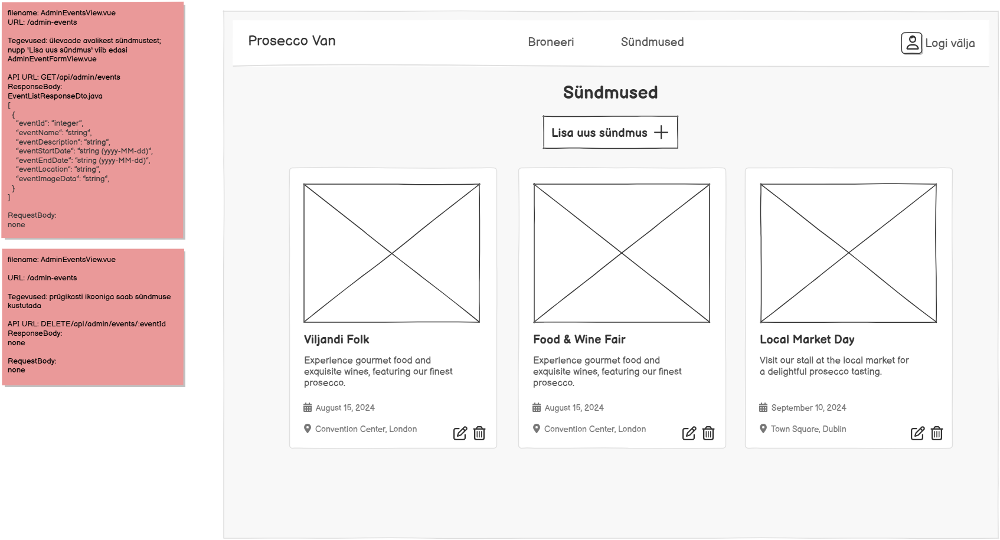

# GET /api/admin/events

**Kontroller:** `AdminEventController.java`
**Tüüp:** Backend
**Staatus:** To Do

## Kontekst

`AdminEventsView.vue` on adminile mõeldud lehekülg (`/admin-events`), kus administraator näeb kõiki Prosecco Vani sündmusi koos redigeerimise ja kustutamise nuppudega. Sama DTO-d kasutatakse ka avalikus `EventsView.vue` vaates (`GET /api/events`), kuid see endpoint on kaitstud — juurdepääs on ainult admin-rolliga kasutajatel. Lehel on ka nupp „Lisa uus sündmus +", mis suunab `AdminEventFormView.vue` lehele.

## Mocki vaade

## API leping

| Väli | Väärtus |
|------|---------|
| Meetod | `GET` |
| Tee | `/api/admin/events` |
| Auth | Jah (admin roll) |

### Request Body

Puudub — GET päring

### Response Body — `EventListResponseDto.java`

> Schema: [`EventListResponseDto_schema.json`](../../dtos/schema/EventListResponseDto_schema.json)
> Näidis: [`EventListResponseDto_AdminEventsView_Array_example.json`](../../dtos/examples/EventListResponseDto_AdminEventsView_Array_example.json)

Tagastatakse massiiv (`List<EventListResponseDto>`).

| Väli | Tüüp | Allikas (DB tabel.veerg) |
|------|------|--------------------------|
| `eventId` | `Integer` | `event.id` |
| `eventName` | `String` | `event.name` |
| `eventDescription` | `String` | `event.description` |
| `eventStartDate` | `String` (yyyy-MM-dd) | `event.start_date` |
| `eventEndDate` | `String` (yyyy-MM-dd) | `event.end_date` |
| `eventLocation` | `String` | `event.location` |
| `imageData` | `String` | `event.image_url` |
| `eventSeason` | `String` (KEVAD \| SUVI \| SÜGIS \| TALV) | arvutatud `event.start_date` kuu põhjal |

## Veahaldus

| Olukord | Exception klass | ErrorResponse enum | HTTP staatus |
|---------|----------------|-------------------|--------------|
| Sündmusi ei leitud (tühi tulemus) | — | — | 200 (tühi massiiv `[]`) |
| Autentimata kasutaja üritab ligi pääseda | — | — | 401 (Spring Security filter) |

> **Märkus veahalduse kohta:**
> Kontrolli, kas vajalikud `ErrorResponse` enum kirjed ja exception klassid juba eksisteerivad:
> - `backend/src/main/java/proseccovan/backend/infrastructure/error/ErrorResponse.java`
> - `backend/src/main/java/proseccovan/backend/infrastructure/exception/`
>
> Autentimise viga (401/403) käsitleb Spring Security filter chain, mitte kontroller ise. Tühi tulemus tagastab HTTP 200 koos tühja massiiviga — viga ei visata.

## Andmebaas

Seotud tabelid: `event`

Loetakse kõik read `event` tabelist. `eventSeason` väli arvutatakse teenuse kihis `start_date` kuu põhjal (KEVAD: märts–mai, SUVI: juuni–august, SÜGIS: september–november, TALV: detsember–veebruar). `image_url` veerg vastendatakse DTO väljale `imageData`. Tabelis on ka `created_by_user_id` FK, kuid seda välja admin-nimekirja vaates ei tagastata.

## Vastuvõtu kriteeriumid

- [ ] `GET /api/admin/events` tagastab HTTP 200 ja kõigi sündmuste massiivi
- [ ] Tühja tulemuse korral tagastatakse HTTP 200 koos tühja massiiviga `[]`
- [ ] `eventSeason` väli vastuses on arvutatud `start_date` kuu põhjal
- [ ] Endpoint on kättesaadav ainult autentitud admin-rolliga kasutajale
- [ ] Autentimata päring tagastab HTTP 401 (Spring Security)
- [ ] Kõik DTO klassid on loodud Java klassidena õigesse paketti
- [ ] Controller, Service, Repository kihid on eraldatud
- [ ] Kontrolleri meetodil on `@Operation` ja `@ApiResponses` annotatsioonid (sh veavastused `ApiError` skeemiga)
- [ ] Swagger UI kaudu on endpoint nähtav ja testitav
