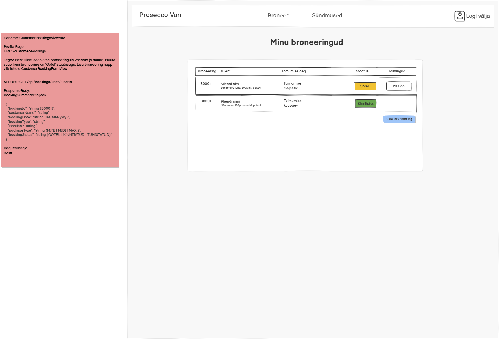

# GET /api/bookings/user/{userId}

**Kontroller:** `CustomerBookingsController.java`
**Tüüp:** Backend
**Staatus:** To Do

## Kontekst

Kliendi broneeringute nimekirja endpoint, mida kasutab `CustomerBookingsView.vue` (URL: `/customer-bookings`). Klient näeb kõiki oma broneeringuid koos staatuse, kuupäeva ja paketi infoga. Broneeringut saab muuta ainult siis, kui selle staatus on "OOTEL" — "Muuda" nupp viib `CustomerBookingFormView.vue` lehele. "Lisa broneering" nupp viib samuti `CustomerBookingFormView.vue` lehele.

## Mocki vaade

## API leping

| Väli   | Väärtus                        |
|--------|--------------------------------|
| Meetod | `GET`                          |
| Tee    | `/api/bookings/user/{userId}`  |
| Auth   | Ei                             |

### Request Body

Puudub — GET päring

### Response Body — `BookingSummaryDto.java`

> Schema: [`BookingSummaryDto_schema.json`](../../dtos/schema/BookingSummaryDto_schema.json)
> Näidis: [`BookingSummaryDto_CustomerBookingsView_Array_example.json`](../../dtos/examples/BookingSummaryDto_CustomerBookingsView_Array_example.json)

Tagastab **massiivi** `BookingSummaryDto` objektidest.

| Väli            | Tüüp     | Allikas (DB tabel.veerg)                              |
|-----------------|----------|-------------------------------------------------------|
| `bookingId`     | `String` | `booking.id` (formaadis "B0001")                      |
| `customerName`  | `String` | `user_contact.user_name`                              |
| `bookingDate`   | `String` | `booking.event_date` (formaadis dd/MM/yyyy)           |
| `bookingType`   | `String` | `booking.booking_type_info`                           |
| `location`      | `String` | `booking.address`                                     |
| `packageType`   | `String` | `package.name` (MINI / MIDI / MAXI)                   |
| `bookingStatus` | `String` | `booking.status` (O=OOTEL, K=KINNITATUD, T=TÜHISTATUD)|

## Veahaldus

| Olukord              | Exception klass          | ErrorResponse enum   | HTTP staatus |
|----------------------|--------------------------|----------------------|--------------|
| Kasutaja ei leitud   | `DataNotFoundException`  | `DATA_NOT_FOUND`     | 404          |

> **Märkus veahalduse kohta:**
> Kontrolli, kas vajalikud `ErrorResponse` enum kirjed ja exception klassid juba eksisteerivad:
> - `backend/src/main/java/proseccovan/backend/infrastructure/error/ErrorResponse.java`
> - `backend/src/main/java/proseccovan/backend/infrastructure/exception/`
>
> Puuduvate enum kirjete puhul lisa need `ErrorResponse`-i. Puuduvate exception klasside puhul loo uus klass `exception/` paketti (järgi olemasolevate klasside mustrit) ja registreeri see `RestExceptionHandler`-is.

## Andmebaas

Seotud tabelid: `booking`, `package`, `user`, `user_contact`

Loetakse kõik `booking` tabeli read, kus `booking.user_id = userId`. Iga broneeringu kohta loetakse paketi nimi `package` tabelist (`booking.package_id → package.id`) ja kliendi nimi `user_contact` tabelist (`user_contact.user_id = userId`). `booking.status` char väärtus teisendatakse tekstiks (O → OOTEL, K → KINNITATUD, T → TÜHISTATUD). `booking.id` formaadis kuvatakse eesliitega "B" ja 4-kohalise numbrina (nt B0001).

## Vastuvõtu kriteeriumid

- [ ] `GET /api/bookings/user/{userId}` tagastab HTTP 200 ja `BookingSummaryDto` massiivi
- [ ] Kui kasutaja broneeringuid ei ole, tagastatakse tühi massiiv `[]`
- [ ] Kasutaja ei leitud: tagastab HTTP 404 koos `DATA_NOT_FOUND` veaga
- [ ] `bookingId` on formaadis "B0001" (mitte lihtsalt täisarv)
- [ ] `bookingDate` on formaadis dd/MM/yyyy
- [ ] `bookingStatus` on loetav tekst (OOTEL / KINNITATUD / TÜHISTATUD), mitte ühetäheline kood
- [ ] Kõik DTO klassid on loodud Java klassidena õigesse paketti
- [ ] Controller, Service, Repository kihid on eraldatud
- [ ] Kontrolleri meetodil on `@Operation` ja `@ApiResponses` annotatsioonid (sh veavastused `ApiError` skeemiga)
- [ ] Swagger UI kaudu on endpoint nähtav ja testitav