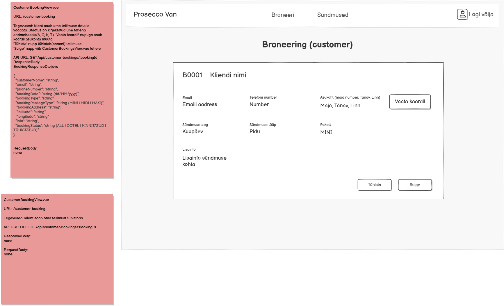

# GET /api/customer-booking/{bookingId}

**Kontroller:** `CustomerBookingController.java`
**Tüüp:** Backend
**Staatus:** To Do

## Kontekst

Ühe broneeringu detailvaate endpoint, mida kasutab `CustomerBookingView.vue` (URL: `/customer-booking`). Klient näeb broneeringu kõiki andmeid — kontaktinfo, sündmuse aeg, tüüp, pakett, asukoht kaardil ja staatus. "Vaata kaardil" nupp kasutab latitude/longitude koordinaate. "Sulge" nupp viib tagasi `CustomerBookingsView.vue` lehele. Samal lehel on ka `DELETE /api/customer-booking/{bookingId}` tühistamise endpoint.

## Mocki vaade

## API leping

| Väli   | Väärtus                             |
|--------|-------------------------------------|
| Meetod | `GET`                               |
| Tee    | `/api/customer-booking/{bookingId}` |
| Auth   | Ei                                  |

### Request Body

Puudub — GET päring

### Response Body — `BookingResponseDto.java`

> Schema: [`BookingResponseDto_schema.json`](../../dtos/schema/BookingResponseDto_schema.json)
> Näidis: [`BookingResponseDto_CustomerBookingView_example.json`](../../dtos/examples/BookingResponseDto_CustomerBookingView_example.json)

| Väli            | Tüüp     | Allikas (DB tabel.veerg)                               |
|-----------------|----------|--------------------------------------------------------|
| `customerName`  | `String` | `user_contact.user_name`                               |
| `email`         | `String` | `user.email`                                           |
| `phoneNumber`   | `String` | `user_contact.phone`                                   |
| `bookingDate`   | `String` | `booking.event_date` (formaadis dd/MM/yyyy)            |
| `bookingType`   | `String` | `booking.booking_type_info`                            |
| `packageType`   | `String` | `package.name` (MINI / MIDI / MAXI)                    |
| `address`       | `String` | `booking.address`                                      |
| `latitude`      | `String` | `booking.latitude`                                     |
| `longitude`     | `String` | `booking.longitude`                                    |
| `bookingInfo`   | `String` | `package.description`                                  |
| `bookingStatus` | `String` | `booking.status` (O=OOTEL, K=KINNITATUD, T=TÜHISTATUD) |

## Veahaldus

| Olukord                | Exception klass         | ErrorResponse enum | HTTP staatus |
|------------------------|-------------------------|--------------------|--------------|
| Broneeringut ei leitud | `DataNotFoundException` | `DATA_NOT_FOUND`   | 404          |

> **Märkus veahalduse kohta:**
> Kontrolli, kas vajalikud `ErrorResponse` enum kirjed ja exception klassid juba eksisteerivad:
> - `backend/src/main/java/proseccovan/backend/infrastructure/error/ErrorResponse.java`
> - `backend/src/main/java/proseccovan/backend/infrastructure/exception/`
>
> Puuduvate enum kirjete puhul lisa need `ErrorResponse`-i. Puuduvate exception klasside puhul loo uus klass `exception/` paketti (järgi olemasolevate klasside mustrit) ja registreeri see `RestExceptionHandler`-is.

## Andmebaas

Seotud tabelid: `booking`, `package`, `user`, `user_contact`

Loetakse `booking` tabelist rida `bookingId` järgi. Kasutaja andmed loetakse `user` ja `user_contact` tabelitest. Paketi nimi ja kirjeldus loetakse `package` tabelist (`booking.package_id → package.id`). `booking.status` char teisendatakse tekstiks (O→OOTEL, K→KINNITATUD, T→TÜHISTATUD). `booking.event_date` formaadis dd/MM/yyyy.

## Vastuvõtu kriteeriumid

- [ ] `GET /api/customer-booking/{bookingId}` tagastab HTTP 200 ja `BookingResponseDto`
- [ ] Broneeringut ei leitud: tagastab HTTP 404 koos `DATA_NOT_FOUND` veaga
- [ ] `bookingDate` on formaadis dd/MM/yyyy
- [ ] `bookingStatus` on loetav tekst (OOTEL / KINNITATUD / TÜHISTATUD), mitte ühetäheline kood
- [ ] Kõik DTO klassid on loodud Java klassidena õigesse paketti
- [ ] Controller, Service, Repository kihid on eraldatud
- [ ] Kontrolleri meetodil on `@Operation` ja `@ApiResponses` annotatsioonid (sh veavastused `ApiError` skeemiga)
- [ ] Swagger UI kaudu on endpoint nähtav ja testitav