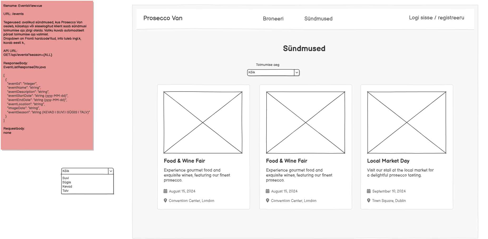

# GET /api/events

**Kontroller:** `EventController.java`
**Tüüp:** Backend
**Staatus:** To Do

## Kontekst

`EventsView.vue` on avalik lehekülg (`/events`), kus kõik külastajad (ka sisselogimata) näevad Prosecco Vani sündmusi. Klient saab sündmusi filtreerida toimumisaja järgi — dropdown valik (Kõik / Kevad / Suvi / Sügis / Talv) saadetakse päringuparameetrina `season`. Väärtus `ALL` tagastab kõik sündmused. Dropdown valikud on Frondi poolt hardcode'itud eesti keeles, kuid päringu enum-väärtused on inglise keeles (KEVAD, SUVI, SÜGIS, TALV). Kuna `event` tabelis puudub `season` veerg, tuleb `eventSeason` vastuses arvutada `start_date` kuu põhjal (KEVAD: märts–mai, SUVI: juuni–august, SÜGIS: september–november, TALV: detsember–veebruar). Sesoonifilter toimub samuti selle arvutuse põhjal.

## Mocki vaade

## API leping

| Väli | Väärtus |
|------|---------|
| Meetod | `GET` |
| Tee | `/api/events?season={season}` |
| Auth | Ei |

### Request Body

Puudub — GET päring

### Response Body — `EventListResponseDto.java`

> Schema: [`EventListResponseDto_schema.json`](../../dtos/schema/EventListResponseDto_schema.json)
> Näidis: [`EventListResponseDto_EventsView_Array_example.json`](../../dtos/examples/EventListResponseDto_EventsView_Array_example.json)

Tagastatakse massiiv (`List<EventListResponseDto>`).

| Väli | Tüüp | Allikas (DB tabel.veerg) |
|------|------|--------------------------|
| `eventId` | `Integer` | `event.id` |
| `eventName` | `String` | `event.name` |
| `eventDescription` | `String` | `event.description` |
| `eventStartDate` | `String` (yyyy-MM-dd) | `event.start_date` |
| `eventEndDate` | `String` (yyyy-MM-dd) | `event.end_date` |
| `eventLocation` | `String` | `event.location` |
| `imageData` | `String` | `event.image_url` |
| `eventSeason` | `String` (KEVAD \| SUVI \| SÜGIS \| TALV) | arvutatud `event.start_date` kuu põhjal |

## Veahaldus

| Olukord | Exception klass | ErrorResponse enum | HTTP staatus |
|---------|----------------|-------------------|--------------|
| Sündmusi ei leitud (tühi tulemus) | — | — | 200 (tühi massiiv `[]`) |

> **Märkus veahalduse kohta:**
> Kontrolli, kas vajalikud `ErrorResponse` enum kirjed ja exception klassid juba eksisteerivad:
> - `backend/src/main/java/proseccovan/backend/infrastructure/error/ErrorResponse.java`
> - `backend/src/main/java/proseccovan/backend/infrastructure/exception/`
>
> Selle endpointi puhul ei viska tühi tulemus viga — tagastatakse HTTP 200 koos tühja massiiviga. Kui tulevikus lisatakse range validatsioon, kasutada `DATA_NOT_FOUND` (333, HTTP 404).

## Andmebaas

Seotud tabelid: `event`

Loetakse kõik read `event` tabelist. Kui `season` parameeter ei ole `ALL`, filtreeritakse tulemused `start_date` kuu põhjal arvutatud sesooni järgi. `event` tabelis puudub eraldi `season` veerg — sesooni arvutus toimub teenuse kihis. `image_url` veerg vastendatakse DTO väljale `imageData`.

## Vastuvõtu kriteeriumid

- [ ] `GET /api/events?season=ALL` tagastab HTTP 200 ja kõigi sündmuste massiivi
- [ ] `GET /api/events?season=SUVI` tagastab HTTP 200 ja ainult suviseid sündmusi (juuni–august)
- [ ] `GET /api/events?season=KEVAD` tagastab HTTP 200 ja ainult kevadiseid sündmusi (märts–mai)
- [ ] `GET /api/events?season=SÜGIS` tagastab HTTP 200 ja ainult sügiseseid sündmusi (september–november)
- [ ] `GET /api/events?season=TALV` tagastab HTTP 200 ja ainult talviseid sündmusi (detsember–veebruar)
- [ ] Tühja tulemuse korral tagastatakse HTTP 200 koos tühja massiiviga `[]`
- [ ] `eventSeason` väli vastuses on arvutatud `start_date` kuu põhjal
- [ ] Endpoint on kättesaadav ilma autentimiseta
- [ ] Kõik DTO klassid on loodud Java klassidena õigesse paketti
- [ ] Controller, Service, Repository kihid on eraldatud
- [ ] Kontrolleri meetodil on `@Operation` ja `@ApiResponses` annotatsioonid
- [ ] Swagger UI kaudu on endpoint nähtav ja testitav
