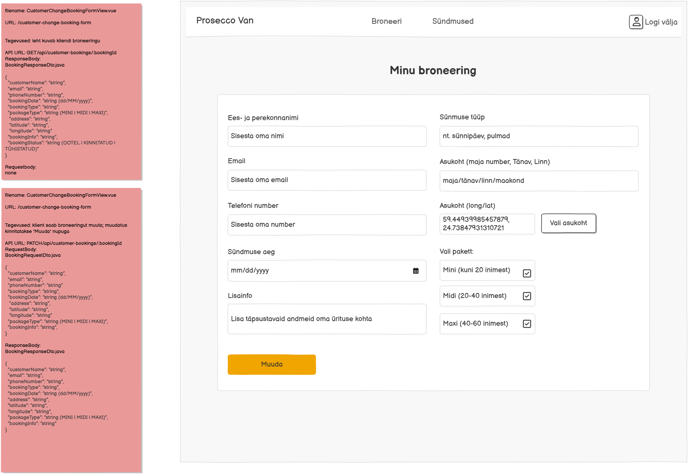

# PATCH /api/customer/bookings/{bookingId}

**Kontroller:** `CustomerChangeBookingController.java`
**Tüüp:** Backend
**Staatus:** To Do

## Kontekst

`CustomerChangeBookingFormView.vue` on kliendile mõeldud broneeringu muutmise lehekülg (`/customer-change-booking-form`). Leht laetakse eeltäidetud vormi andmetega (`GET /api/customer/bookings/{bookingId}` kaudu) ja kasutaja saab muuta kõiki välju: nimi, email, telefon, kuupäev, sündmuse tüüp, asukoht, pakett ja lisainfo. „Muuda" nupule vajutades saadetakse uuendatud andmed sellele endpointile. Endpoint on kaitstud — ainult autentitud kasutaja saab oma broneeringut muuta.

## Mocki vaade

## API leping

| Väli | Väärtus |
|------|---------|
| Meetod | `PATCH` |
| Tee | `/api/customer/bookings/{bookingId}` |
| Auth | Jah |

### Request Body — `BookingRequestDto.java`

> Schema: [`BookingRequestDto_schema.json`](../../dtos/schema/BookingRequestDto_schema.json)
> Näidis: [`BookingRequestDto_CustomerChangeBookingFormView_example.json`](../../dtos/examples/BookingRequestDto_CustomerChangeBookingFormView_example.json)

| Väli | Tüüp | Kirjeldus |
|------|------|-----------|
| `customerName` | `String` | Kliendi ees- ja perekonnanimi |
| `email` | `String` | Kliendi e-posti aadress |
| `phoneNumber` | `String` | Kliendi telefoninumber |
| `bookingDate` | `String` (yyyy-MM-dd) | Sündmuse kuupäev |
| `bookingType` | `String` | Sündmuse tüüp (nt Sünnipäev, Pulmad) |
| `address` | `String` | Sündmuse asukoha aadress |
| `latitude` | `String` | Koordinaat — laiuskraad |
| `longitude` | `String` | Koordinaat — pikkuskraad |
| `packageType` | `String` (`MINI` \| `MIDI` \| `MAXI`) | Valitud paketi tüüp |
| `bookingInfo` | `String` | Lisainfo sündmuse kohta |

### Response Body — `BookingResponseDto.java`

> Schema: [`BookingResponseDto_schema.json`](../../dtos/schema/BookingResponseDto_schema.json)
> Näidis: [`BookingResponseDto_CustomerChangeBookingFormView_example.json`](../../dtos/examples/BookingResponseDto_CustomerChangeBookingFormView_example.json)

| Väli | Tüüp | Allikas (DB tabel.veerg) |
|------|------|--------------------------|
| `customerName` | `String` | `user_contact.user_name` |
| `email` | `String` | `user.email` |
| `phoneNumber` | `String` | `user_contact.phone` |
| `bookingDate` | `String` (dd/MM/yyyy) | `booking.event_date` |
| `bookingType` | `String` | `booking.booking_type_info` |
| `bookingPackageType` | `String` (`MINI` \| `MIDI` \| `MAXI`) | `package.name` |
| `bookingAddress` | `String` | `booking.address` |
| `latitude` | `String` | `booking.latitude` |
| `longitude` | `String` | `booking.longitude` |
| `info` | `String` | `package.description` |
| `bookingStatus` | `String` (`OOTEL` \| `KINNITATUD` \| `TÜHISTATUD`) | `booking.status` — teisendus: `O`→`OOTEL`, `K`→`KINNITATUD`, `T`→`TÜHISTATUD` |

## Veahaldus

| Olukord | Exception klass | ErrorResponse enum | HTTP staatus |
|---------|----------------|-------------------|--------------|
| Broneeringut antud `bookingId`-ga ei leitud | `DataNotFoundException` | `DATA_NOT_FOUND` (333) | 404 |
| Valitud paketti ei leita andmebaasist | `DataNotFoundException` | `PACKAGE_NOT_FOUND` (444) | 404 |
| Autentimata kasutaja üritab muuta | — | — | 401 (Spring Security filter) |

> **Märkus veahalduse kohta:**
> Kontrolli, kas vajalikud `ErrorResponse` enum kirjed ja exception klassid juba eksisteerivad:
> - `backend/src/main/java/proseccovan/backend/infrastructure/error/ErrorResponse.java`
> - `backend/src/main/java/proseccovan/backend/infrastructure/exception/`
>
> `DataNotFoundException`, `DATA_NOT_FOUND` (333) ja `PACKAGE_NOT_FOUND` (444) on juba olemas — kasuta neid. Autentimise viga (401) käsitleb Spring Security filter chain.

## Andmebaas

Seotud tabelid: `booking`, `user`, `user_contact`, `package`

Otsitakse `booking` tabelist rida `id = bookingId` järgi — kui ei leita, visatakse `DataNotFoundException`. Otsitakse `package` tabelist pakett nime järgi (`package.name = packageType`) — kui ei leita, visatakse `DataNotFoundException` koodiga 444. Uuendatakse järgmised väljad:
- `booking`: `event_date`, `booking_type_info`, `address`, `latitude`, `longitude`, `package_id`
- `user_contact`: `user_name`, `phone` (joined `booking.user_id = user_contact.user_id`)
- `user`: `email` (joined `booking.user_id`)

`bookingInfo` välja andmebaasis ei salvestata — `booking` tabelis vastav veerg puudub. Tagastamiseks joinitakse `package` tabel uuendatud `bookingResponseDto` koostamiseks.

## Vastuvõtu kriteeriumid

- [ ] `PATCH /api/customer/bookings/{bookingId}` tagastab HTTP 200 ja uuendatud `BookingResponseDto`
- [ ] Kõik `booking` tabeli väljad on uuendatud (`event_date`, `booking_type_info`, `address`, `latitude`, `longitude`, `package_id`)
- [ ] `user_contact.user_name` ja `user_contact.phone` on uuendatud
- [ ] `user.email` on uuendatud
- [ ] Olematu `bookingId` korral tagastatakse HTTP 404 koos `DATA_NOT_FOUND` (333) veaga
- [ ] Olematu `packageType` korral tagastatakse HTTP 404 koos `PACKAGE_NOT_FOUND` (444) veaga
- [ ] Autentimata päring tagastab HTTP 401 (Spring Security)
- [ ] Kõik DTO klassid on loodud Java klassidena õigesse paketti
- [ ] Controller, Service, Repository kihid on eraldatud
- [ ] Kontrolleri meetodil on `@Operation` ja `@ApiResponses` annotatsioonid (sh veavastused `ApiError` skeemiga)
- [ ] Swagger UI kaudu on endpoint nähtav ja testitav
