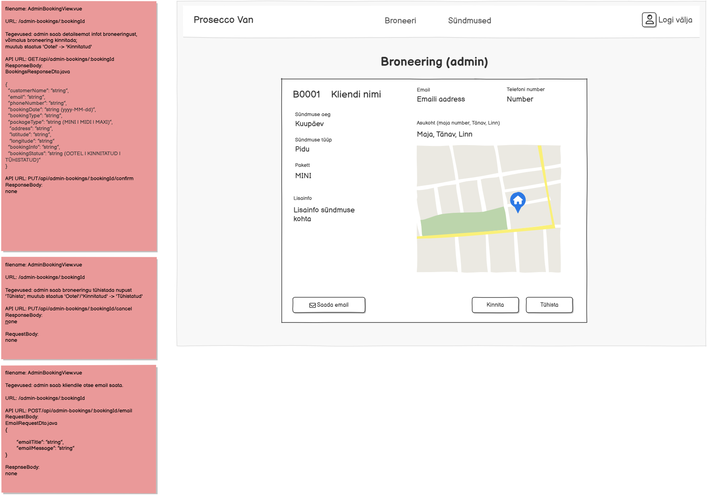

# POST /api/admin-bookings/{bookingId}/email

**Kontroller:** `AdminBookingController.java`
**Tüüp:** Backend
**Staatus:** To Do

## Kontekst

Emaili saatmise endpoint, mida kasutab `AdminBookingView.vue` (URL: `/admin-bookings/:bookingId`). Admin saab "Saada email" nupuga kliendile otse emaili saata — sisestab pealkirja ja sõnumi. Email saadetakse broneeringuga seotud kliendi emaili aadressile (`user.email`). Samal lehel on ka `GET /api/admin-bookings/{bookingId}`, `PUT .../confirm` ja `PUT .../cancel`.

## Mocki vaade

## API leping

| Väli   | Väärtus                                    |
|--------|--------------------------------------------|
| Meetod | `POST`                                     |
| Tee    | `/api/admin-bookings/{bookingId}/email`    |
| Auth   | Ei                                         |

### Request Body — `EmailRequestDto.java`

> Schema: [`EmailRequestDto_schema.json`](../../dtos/schema/EmailRequestDto_schema.json)
> Näidis: [`EmailRequestDto_AdminBookingView_example.json`](../../dtos/examples/EmailRequestDto_AdminBookingView_example.json)

| Väli           | Tüüp     | Kirjeldus         |
|----------------|----------|-------------------|
| `emailTitle`   | `String` | Emaili pealkiri   |
| `emailMessage` | `String` | Emaili sisu       |

### Response Body

Puudub — HTTP 200 tühi vastus

## Veahaldus

| Olukord                | Exception klass         | ErrorResponse enum | HTTP staatus |
|------------------------|-------------------------|--------------------|--------------|
| Broneeringut ei leitud | `DataNotFoundException` | `DATA_NOT_FOUND`   | 404          |

> **Märkus veahalduse kohta:**
> Kontrolli, kas vajalikud `ErrorResponse` enum kirjed ja exception klassid juba eksisteerivad:
> - `backend/src/main/java/proseccovan/backend/infrastructure/error/ErrorResponse.java`
> - `backend/src/main/java/proseccovan/backend/infrastructure/exception/`

## Andmebaas

Seotud tabelid: `booking`, `user`

Loetakse `booking` tabelist rida `bookingId` järgi. Kliendi email loetakse `user` tabelist (`booking.user_id → user.id`). Email saadetakse `user.email` aadressile kasutades Spring `JavaMailSender` teenust.

> **Märkus emaili kohta:** emaili saatmine nõuab `JavaMailSender` konfiguratsiooni `application.properties`-is (SMTP seaded). Kui email teenus ei ole konfigureeritud, tuleb see eraldi seadistada.

## Vastuvõtu kriteeriumid

- [ ] `POST /api/admin-bookings/{bookingId}/email` tagastab HTTP 200
- [ ] Broneeringut ei leitud: tagastab HTTP 404 koos `DATA_NOT_FOUND` veaga
- [ ] Email saadetakse broneeringuga seotud kliendi aadressile
- [ ] Kõik DTO klassid on loodud Java klassidena õigesse paketti
- [ ] Controller, Service, Repository kihid on eraldatud
- [ ] Kontrolleri meetodil on `@Operation` ja `@ApiResponses` annotatsioonid (sh veavastused `ApiError` skeemiga)
- [ ] Swagger UI kaudu on endpoint nähtav ja testitav