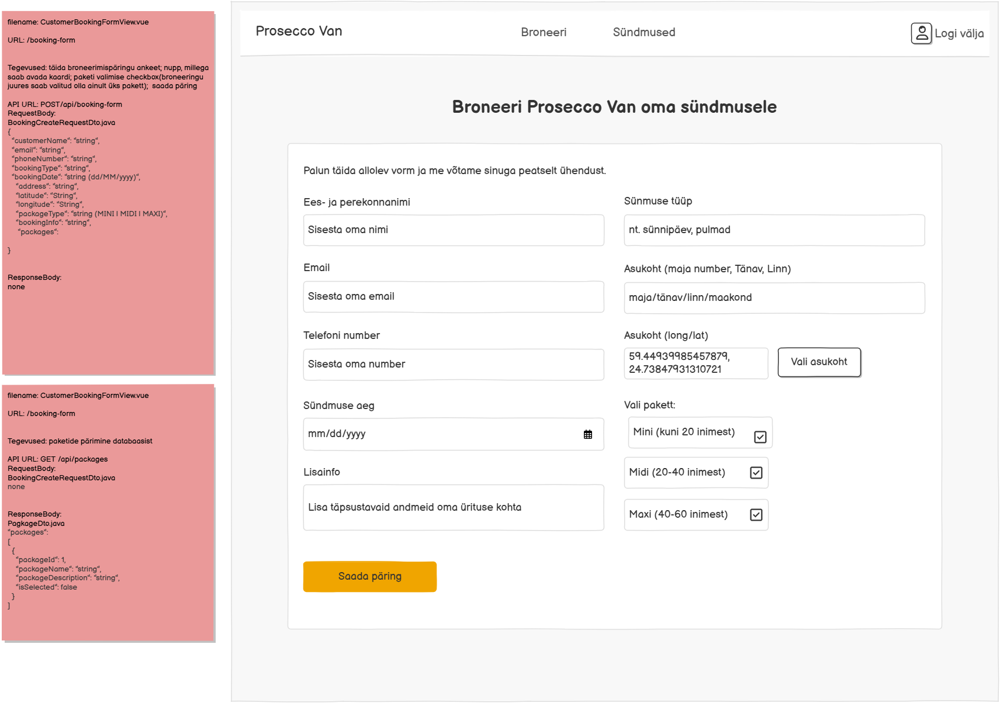
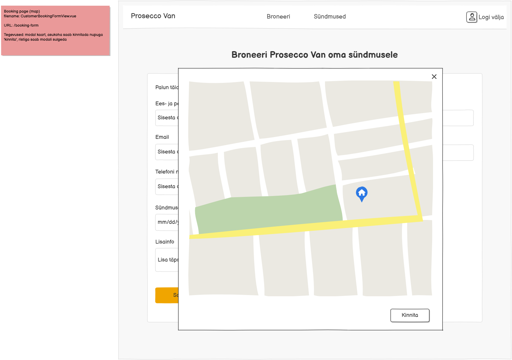

# POST /api/booking-form

**Kontroller:** `CustomerBookingController.java`
**Tüüp:** Backend
**Staatus:** To Do

## Kontekst

Broneerimispäringu loomise endpoint, mida kasutab `CustomerBookingFormView.vue` (URL: `/booking-form`). Kasutaja täidab vormi (nimi, email, telefon, sündmuse tüüp, asukoht, kuupäev, pakett, lisainfo) ja vajutab "Saada päring". Asukoha koordinaadid (lat/long) sisestatakse kaardiga — `Vali asukoht` nupp avab modaalakna kaardiga, kus kasutaja kinnitab asukohta nupuga "Kinnita". Pakettidest saab valida ainult ühe (MINI/MIDI/MAXI) — paketid laetakse eraldi `GET /api/packages` kaudu.

## Mocki vaade

## API leping

| Väli   | Väärtus              |
|--------|----------------------|
| Meetod | `POST`               |
| Tee    | `/api/booking-form`  |
| Auth   | Jah                  |

### Request Body — `BookingCreateRequestDto.java`

> Schema: [`BookingCreateRequestDto_schema.json`](../../dtos/schema/BookingCreateRequestDto_schema.json)
> Näidis: [`BookingCreateRequestDto_CustomerBookingFormView_example.json`](../../dtos/examples/BookingCreateRequestDto_CustomerBookingFormView_example.json)

| Väli            | Tüüp     | Kirjeldus                                         |
|-----------------|----------|---------------------------------------------------|
| `customerName`  | `String` | Kliendi ees- ja perekonnanimi                     |
| `email`         | `String` | Kliendi e-posti aadress                           |
| `phoneNumber`   | `String` | Kliendi telefoninumber                            |
| `bookingType`   | `String` | Sündmuse tüüp (nt sünnipäev, pulmad)              |
| `bookingDate`   | `String` | Sündmuse kuupäev formaadis `dd/MM/yyyy`           |
| `address`       | `String` | Sündmuse asukoha aadress (maja, tänav, linn)      |
| `latitude`      | `String` | Koordinaat — laiuskraad (kaardilt valitud)        |
| `longitude`     | `String` | Koordinaat — pikkuskraad (kaardilt valitud)       |
| `packageType`   | `String` | Valitud paketi tüüp: `MINI`, `MIDI` või `MAXI`   |
| `bookingInfo`   | `String` | Lisainfo sündmuse kohta                           |

### Response Body

Puudub — HTTP 200 tühi vastus

## Veahaldus

| Olukord                              | Exception klass        | ErrorResponse enum   | HTTP staatus |
|--------------------------------------|------------------------|----------------------|--------------|
| Valitud paketti ei leita andmebaasist | `DataNotFoundException` | `PACKAGE_NOT_FOUND`  | 404          |

> **Märkus veahalduse kohta:**
> Kontrolli, kas vajalikud `ErrorResponse` enum kirjed ja exception klassid juba eksisteerivad:
> - `backend/src/main/java/proseccovan/backend/infrastructure/error/ErrorResponse.java`
> - `backend/src/main/java/proseccovan/backend/infrastructure/exception/`
>
> Puuduvate enum kirjete puhul lisa need `ErrorResponse`-i. Puuduvate exception klasside puhul loo uus klass
> `exception/` paketti (järgi olemasolevate klasside mustrit) ja registreeri see `RestExceptionHandler`-is.

## Andmebaas

Seotud tabelid: `booking`, `package`

Otsitakse `package` tabelist rida, kus `package.name = packageType` — saadakse `package.id`. Kui paketti ei leita, visatakse `DataNotFoundException`. Salvestatakse `booking` tabelisse: `user_id` (autentitud kasutaja ID), `package_id` (leitud paketi ID), `address`, `longitude`, `latitude`, `event_date` (`bookingDate` teisendatuna `dd/MM/yyyy` → `LocalDate`), `booking_type_info` (`bookingType` väärtus), `status = 'P'` (pending).

## Vastuvõtu kriteeriumid

- [ ] `POST /api/booking-form` õigete andmetega salvestab broneeringu andmebaasi ja tagastab HTTP 200
- [ ] Valitud paketti ei leita: tagastab HTTP 404 koos `PACKAGE_NOT_FOUND` veaga
- [ ] `BookingCreateRequestDto` on loodud Java klassina õigesse paketti
- [ ] Controller, Service, Repository kihid on eraldatud
- [ ] Kontrolleri meetodil on `@Operation` ja `@ApiResponses` annotatsioonid (sh veavastused `ApiError` skeemiga)
- [ ] Swagger UI kaudu on endpoint nähtav ja testitav
