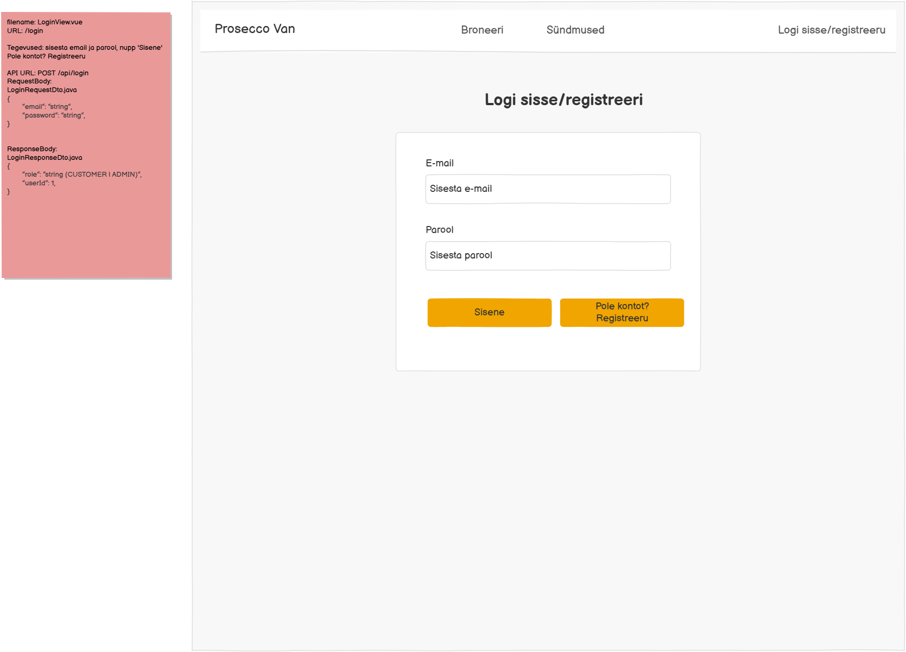

# POST /api/login

**Kontroller:** `AuthController.java`
**Tüüp:** Backend
**Staatus:** To Do

## Kontekst

Sisselogimise endpoint, mida kasutab `LoginView.vue` (URL: `/login`). Kasutaja sisestab emaili ja parooli ning klõpsab "Sisene" — süsteem kontrollib andmebaasist ja tagastab rolli ning kasutaja ID. Vale sisendi korral kuvatakse punane veateade "Vale e-mail või parool" ja sisendväljad tõstetakse punasega esile. "Pole kontot? Registreeru" nupp suunab `RegisterView.vue` lehele.

## Mocki vaade

## API leping

| Väli | Väärtus |
|------|---------|
| Meetod | `POST` |
| Tee | `/api/login` |
| Auth | Ei |

### Request Body — `LoginRequestDto.java`

> Schema: [`LoginRequestDto_schema.json`](../../dtos/schema/LoginRequestDto_schema.json)
> Näidis: [`LoginRequestDto_LoginView_example.json`](../../dtos/examples/LoginRequestDto_LoginView_example.json)

| Väli | Tüüp | Kirjeldus |
|------|------|-----------|
| `email` | `String` | Kasutaja e-posti aadress |
| `password` | `String` | Kasutaja parool |

### Response Body — `LoginResponseDto.java`

> Schema: [`LoginResponseDto_schema.json`](../../dtos/schema/LoginResponseDto_schema.json)
> Näidis: [`LoginResponseDto_LoginView_example.json`](../../dtos/examples/LoginResponseDto_LoginView_example.json)

| Väli | Tüüp | Allikas (DB tabel.veerg) |
|------|------|--------------------------|
| `userId` | `Integer` | `user.id` |
| `role` | `String` | `role.name` (CUSTOMER või ADMIN) |
| `userName` | `String` | `user_contact.user_name` |

## Veahaldus

| Olukord | Exception klass | ErrorResponse enum | HTTP staatus |
|---------|----------------|-------------------|--------------|
| Vale e-mail või parool | `InvalidLoginException` | `INVALID_LOGIN` | 401 |

> **Märkus veahalduse kohta:**
> Kontrolli, kas vajalikud `ErrorResponse` enum kirjed ja exception klassid juba eksisteerivad:
> - `backend/src/main/java/proseccovan/backend/infrastructure/error/ErrorResponse.java`
> - `backend/src/main/java/proseccovan/backend/infrastructure/exception/`
>
> Puuduvate enum kirjete puhul lisa need `ErrorResponse`-i. Puuduvate exception klasside puhul loo uus klass `exception/` paketti (järgi olemasolevate klasside mustrit) ja registreeri see `RestExceptionHandler`-is.

## Andmebaas

Seotud tabelid: `user`, `role`, `user_contact`

Loetakse `user` tabelist rida, kus `user.email = email`. Võrreldakse `user.password` väärtust. Rolli nimi loetakse `role` tabelist (`user.role_id → role.id`). Kasutajanimi loetakse `user_contact` tabelist (`user_contact.user_id = user.id`). Kui emaili või parooli ei leidu → viska `InvalidLoginException`.

## Vastuvõtu kriteeriumid

- [ ] `POST /api/login` õigete andmetega tagastab HTTP 200 ja `LoginResponseDto` (userId, role, userName)
- [ ] Vale e-mail või parool: tagastab HTTP 401 koos `INVALID_LOGIN` veaga
- [ ] Kõik DTO klassid on loodud Java klassidena õigesse paketti
- [ ] Controller, Service, Repository kihid on eraldatud
- [ ] Kontrolleri meetodil on `@Operation` ja `@ApiResponses` annotatsioonid (sh veavastused `ApiError` skeemiga)
- [ ] Swagger UI kaudu on endpoint nähtav ja testitav