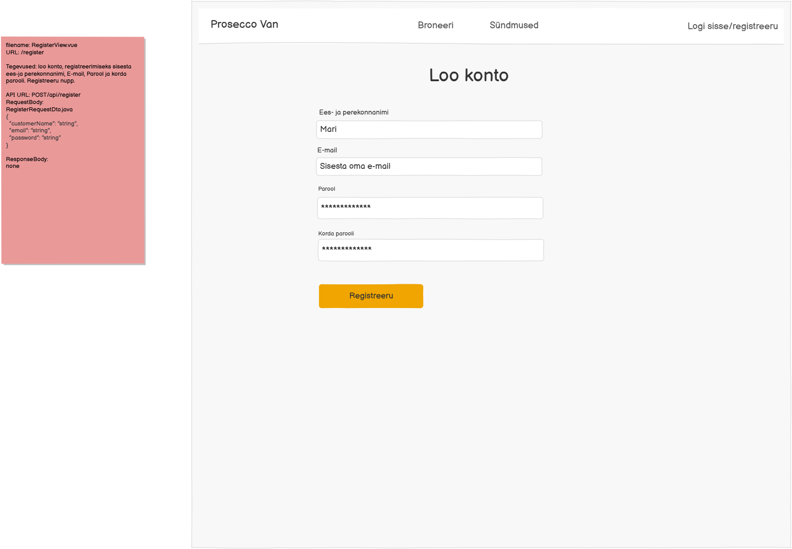

# POST /api/register

**Kontroller:** `RegisterController.java`
**Tüüp:** Backend
**Staatus:** To Do

## Kontekst

Registreerimise endpoint, mida kasutab `RegisterView.vue` (URL: `/register`). Kasutaja sisestab oma ees- ja perekonnanime, e-posti aadressi, parooli ja kordab parooli, seejärel klõpsab "Registreeru". Backend loob uue kasutaja `user` tabelisse (vaikimisi rolliga CUSTOMER) ja lisab kontaktinfo `user_contact` tabelisse. Kui sama e-posti aadressiga kasutaja juba eksisteerib, tagastatakse viga.

## Mocki vaade

## API leping

| Väli   | Väärtus         |
|--------|-----------------|
| Meetod | `POST`          |
| Tee    | `/api/register` |
| Auth   | Ei              |

### Request Body — `RegisterRequestDto.java`

> Schema: [`RegisterRequestDto_schema.json`](../../dtos/schema/RegisterRequestDto_schema.json)
> Näidis: [`RegisterRequestDto_RegisterView_example.json`](../../dtos/examples/RegisterRequestDto_RegisterView_example.json)

| Väli           | Tüüp     | Kirjeldus                          |
|----------------|----------|------------------------------------|
| `customerName` | `String` | Kasutaja ees- ja perekonnanimi     |
| `email`        | `String` | Kasutaja e-posti aadress           |
| `password`     | `String` | Kasutaja parool (lahtise tekstina) |

### Response Body

Puudub — HTTP 200 tühi vastus

## Veahaldus

| Olukord                       | Exception klass               | ErrorResponse enum     | HTTP staatus |
|-------------------------------|-------------------------------|------------------------|--------------|
| E-post on juba registreeritud | `EmailAlreadyExistsException` | `EMAIL_ALREADY_EXISTS` | 409          |

> **Märkus veahalduse kohta:**
> Kontrolli, kas vajalikud `ErrorResponse` enum kirjed ja exception klassid juba eksisteerivad:
> - `backend/src/main/java/proseccovan/backend/infrastructure/error/ErrorResponse.java`
> - `backend/src/main/java/proseccovan/backend/infrastructure/exception/`
>
> Puuduvate enum kirjete puhul lisa need `ErrorResponse`-i. Puuduvate exception klasside puhul loo uus klass `exception/` paketti (järgi olemasolevate klasside mustrit) ja registreeri see `RestExceptionHandler`-is.

## Andmebaas

Seotud tabelid: `user`, `user_contact`, `role`

Luuakse uus rida `user` tabelisse väljadega `email`, `password` ja `role_id` (viide `role` tabelile, vaikimisi CUSTOMER roll). Seejärel luuakse `user_contact` tabelisse rida väljadega `user_id` (vastloodud kasutaja ID) ja `user_name` (RequestBody `customerName` väärtus). Enne loomist kontrollida, et `user.email` ei ole juba andmebaasis kasutusel — duplikaadi korral visata `EmailAlreadyExistsException`.

## Vastuvõtu kriteeriumid

- [ ] `POST /api/register` õigete andmetega tagastab HTTP 200 tühja vastusega
- [ ] E-post on juba registreeritud: tagastab HTTP 409 koos `EMAIL_ALREADY_EXISTS` veaga
- [ ] Kõik DTO klassid on loodud Java klassidena õigesse paketti
- [ ] Controller, Service, Repository kihid on eraldatud
- [ ] Kontrolleri meetodil on `@Operation` ja `@ApiResponses` annotatsioonid (sh veavastused `ApiError` skeemiga)
- [ ] Swagger UI kaudu on endpoint nähtav ja testitav