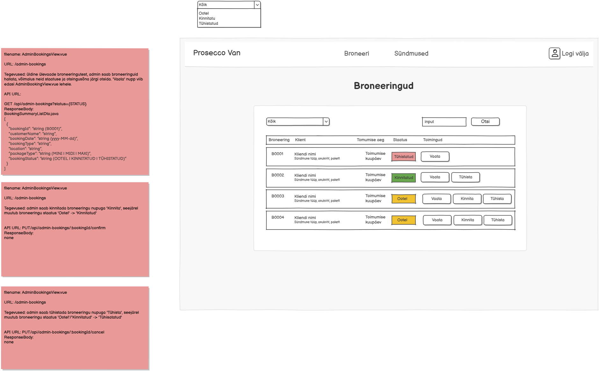

# PUT /api/admin-bookings/{bookingId}/cancel

**Kontroller:** `AdminBookingsController.java`
**Tüüp:** Backend
**Staatus:** To Do

## Kontekst

Broneeringu tühistamise endpoint, mida kasutab `AdminBookingsView.vue` (URL: `/admin-bookings`). Admin klõpsab "Tühista" nuppu — broneeringu staatus muutub OOTEL/KINNITATUD → TÜHISTATUD. Juba tühistatud broneeringut uuesti tühistada ei saa. Samal lehel on ka `GET /api/admin-bookings` ja `PUT /api/admin-bookings/{bookingId}/confirm`.

## Mocki vaade

## API leping

| Väli   | Väärtus                                  |
|--------|------------------------------------------|
| Meetod | `PUT`                                    |
| Tee    | `/api/admin-bookings/{bookingId}/cancel` |
| Auth   | Ei                                       |

### Request Body

Puudub

### Response Body

Puudub — HTTP 200 tühi vastus

## Veahaldus

| Olukord                               | Exception klass         | ErrorResponse enum        | HTTP staatus |
|---------------------------------------|-------------------------|---------------------------|--------------|
| Broneeringut ei leitud                | `DataNotFoundException` | `DATA_NOT_FOUND`          | 404          |
| Broneering on juba TÜHISTATUD         | `ForbiddenException`    | `CANCELLATION_NOT_ALLOWED`| 403          |

> **Märkus veahalduse kohta:**
> Kontrolli, kas vajalikud `ErrorResponse` enum kirjed ja exception klassid juba eksisteerivad:
> - `backend/src/main/java/proseccovan/backend/infrastructure/error/ErrorResponse.java`
> - `backend/src/main/java/proseccovan/backend/infrastructure/exception/`
>
> Puuduvate enum kirjete puhul lisa need `ErrorResponse`-i. Puuduvate exception klasside puhul loo uus klass `exception/` paketti (järgi olemasolevate klasside mustrit) ja registreeri see `RestExceptionHandler`-is.

## Andmebaas

Seotud tabelid: `booking`

Loetakse `booking` tabelist rida `bookingId` järgi. Kui ei leita, visatakse `DataNotFoundException`. Kui `booking.status == 'T'`, visatakse `ForbiddenException`. Vastasel juhul uuendatakse `booking.status = 'T'` (TÜHISTATUD) — töötab nii OOTEL kui KINNITATUD staatuse puhul.

## Vastuvõtu kriteeriumid

- [ ] `PUT /api/admin-bookings/{bookingId}/cancel` OOTEL broneeringu puhul tagastab HTTP 200
- [ ] `PUT /api/admin-bookings/{bookingId}/cancel` KINNITATUD broneeringu puhul tagastab HTTP 200
- [ ] Broneeringut ei leitud: tagastab HTTP 404 koos `DATA_NOT_FOUND` veaga
- [ ] Broneering on juba TÜHISTATUD: tagastab HTTP 403 koos `CANCELLATION_NOT_ALLOWED` veaga
- [ ] Controller, Service, Repository kihid on eraldatud
- [ ] Kontrolleri meetodil on `@Operation` ja `@ApiResponses` annotatsioonid (sh veavastused `ApiError` skeemiga)
- [ ] Swagger UI kaudu on endpoint nähtav ja testitav