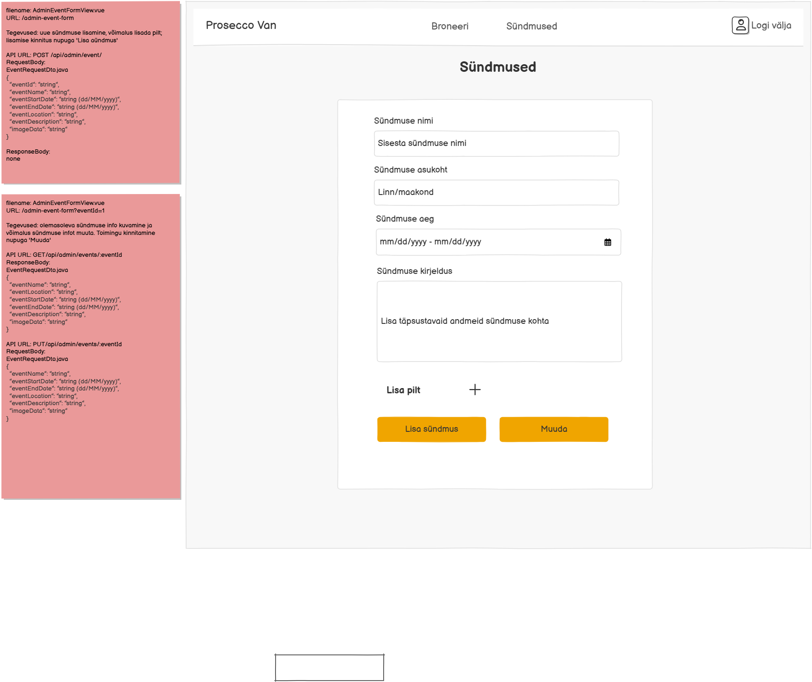

# PUT /api/admin/events/{eventId}

**Kontroller:** `AdminEventController.java`
**Tüüp:** Backend
**Staatus:** To Do

## Kontekst

`AdminEventFormView.vue` on adminile mõeldud lehekülg (`/admin-event-form`), kus administraator saab muuta olemasolevat sündmust. Kui admin on laaditud vormi andmed muutnud ja klõpsab „Muuda" nupul, saadetakse uuendatud andmed sellele endpointile koos `eventId`-ga URL-is. Pärast edukat uuendamist suunab frontend tagasi `AdminEventsView.vue` lehele (`/admin-events`). Endpoint on kaitstud — ainult admin-rolliga kasutajad saavad sündmusi muuta.

## Mocki vaade

## API leping

| Väli | Väärtus |
|------|---------|
| Meetod | `PUT` |
| Tee | `/api/admin/events/{eventId}` |
| Auth | Jah (admin roll) |

### Request Body — `EventRequestDto.java`

> Schema: [`EventRequestDto_schema.json`](../../dtos/schema/EventRequestDto_schema.json)
> Näidis: [`EventRequestDto_AdminEventFormView_example.json`](../../dtos/examples/EventRequestDto_AdminEventFormView_example.json)

| Väli | Tüüp | Kirjeldus |
|------|------|-----------|
| `eventName` | `String` | Sündmuse nimi |
| `eventStartDate` | `String` (yyyy-MM-dd) | Sündmuse alguskuupäev |
| `eventEndDate` | `String` (yyyy-MM-dd) | Sündmuse lõpukuupäev |
| `eventLocation` | `String` | Sündmuse asukoht |
| `eventDescription` | `String` | Sündmuse kirjeldus |
| `imageData` | `String` | Pildi URL |

### Response Body — `EventDetailResponseDto.java`

> Schema: [`EventDetailResponseDto_schema.json`](../../dtos/schema/EventDetailResponseDto_schema.json)
> Näidis: [`EventDetailResponseDto_AdminEventFormView_example.json`](../../dtos/examples/EventDetailResponseDto_AdminEventFormView_example.json)

| Väli | Tüüp | Allikas (DB tabel.veerg) |
|------|------|--------------------------|
| `eventId` | `Integer` | `event.id` |
| `eventName` | `String` | `event.name` |
| `eventStartDate` | `String` (yyyy-MM-dd) | `event.start_date` |
| `eventEndDate` | `String` (yyyy-MM-dd) | `event.end_date` |
| `eventLocation` | `String` | `event.location` |
| `eventDescription` | `String` | `event.description` |
| `imageData` | `String` | `event.image_url` |

## Veahaldus

| Olukord | Exception klass | ErrorResponse enum | HTTP staatus |
|---------|----------------|-------------------|--------------|
| Sündmust antud `eventId`-ga ei leitud | `DataNotFoundException` | `DATA_NOT_FOUND` (333) | 404 |
| Autentimata kasutaja üritab muuta | — | — | 401 (Spring Security filter) |

> **Märkus veahalduse kohta:**
> Kontrolli, kas vajalikud `ErrorResponse` enum kirjed ja exception klassid juba eksisteerivad:
> - `backend/src/main/java/proseccovan/backend/infrastructure/error/ErrorResponse.java`
> - `backend/src/main/java/proseccovan/backend/infrastructure/exception/`
>
> `DataNotFoundException` ja `DATA_NOT_FOUND` (333) on juba olemas — kasuta neid. Autentimise viga (401) käsitleb Spring Security filter chain.

## Andmebaas

Seotud tabelid: `event`

Uuendatakse üks rida `event` tabelist, kus `id = eventId`. Kõik `EventRequestDto` väljad kirjutatakse üle (`name`, `location`, `start_date`, `end_date`, `description`, `image_url`). `created_by_user_id` ei muudeta. Enne uuendamist tuleb kontrollida, kas kirje eksisteerib — kui mitte, visata `DataNotFoundException`.

## Vastuvõtu kriteeriumid

- [ ] `PUT /api/admin/events/{eventId}` tagastab HTTP 200 ja uuendatud sündmuse andmed
- [ ] Olematu `eventId` korral tagastatakse HTTP 404 koos `DATA_NOT_FOUND` (333) veaga
- [ ] Kõik `EventRequestDto` väljad on andmebaasis uuendatud
- [ ] `created_by_user_id` jääb muutmata
- [ ] Autentimata päring tagastab HTTP 401 (Spring Security)
- [ ] Kõik DTO klassid on loodud Java klassidena õigesse paketti
- [ ] Controller, Service, Repository kihid on eraldatud
- [ ] Kontrolleri meetodil on `@Operation` ja `@ApiResponses` annotatsioonid (sh veavastused `ApiError` skeemiga)
- [ ] Swagger UI kaudu on endpoint nähtav ja testitav
